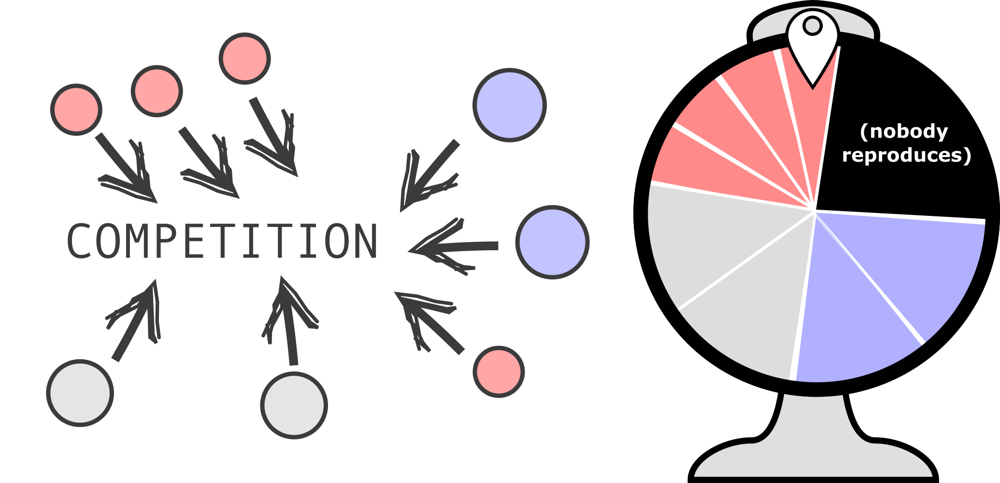

---
params:
  show_answers: false
---

# Mutation and selection

## Moran processes and spatial populations

During the lecture, we discussed the differences between the genotype (that which mutates) and the phenotype (that which is selected). Although you have likely already heard about these concepts, how can we study them in  evolutionary models? During this practical, you will write your own evolutionary algorithms of increasing complexity, in order to learn about these topics. By the end of this practical, you should understand why the translation from genotype to phenotype (often referred to as the genotype-phenotype map) is such an important concept in evolutionary biology.

## Simple model where fitness as a number

In the introduction of this course part on evolution, we have already looked at as simple "Moran process":

1. Start with a population of individuals, each with a fitness value
2. Sample one individual weighted by its fitness ("winner") 
3. Replace a random individual ("loser") with a copy of the "winner"
4. With a small probability, modify the fitness value of the newborn

And so on. 

With a Moran process, competition between individuals is modeled in a very indirect ("implicit") way. By always selecting fit individuals, and removing a random other, any individual in the populations could be replaced by another individual, which statistically is a fitter individual. One could thus say that "everyone is competing with everyone". But we could also imagine just a small subset of individuals are competing. For this, imagine a roulette wheel:

{#fig-roulette}

Just as before, not all individuals have the same size on the roulette wheel (this represents the weighted sampling), which could represent their growth rates, biomass, or other approximations of "fitness". Also notice how the wheel only contains a few individuals, plus an extra (black) area which shapes the chance that nobody reproduces. Let's look at the code for a roulette wheel like this. **Read and test the code below thoroughly before you move on to the next section**.

```{pyodide}
# Import necessary libraries
import random 

# Make up some individuals and their fitness values
individuals = ["Maca", "Momo", "Miffy", "Maddy", "Minky", "Mooby"]
fitnesses = [0.1, 0.01, 0.5, 0.2, 1e-20, 0.2]

# Calculate the total fitness 
total = sum(fitnesses)

# Sample a winner and print it
winner = random.choices(individuals, weights=fitnesses, k=1)[0]
print(f"{winner} reproduces!")
```


:::{#exr-roulette}

## Questions about the roulette wheel - Algorithmic thinking

<br>

a. Modify the code to make all individuals much less fit (e.g. make all fitnesses 100-fold smaller). Spin the wheel multiple times by using the code above. What happens?
b. How can you modify the code to make the code represent @fig-roulette better. Try it!
:::


:::{.content-visible when-meta="params.show_answers"}
> **Answer**<br>
a. Nothing really changes, all that has changed is relative fitnesses but it still samples the same individuals with the same chance. 
b. We would like the odds of nobody reproducing to be represented (the black slice in @fig-roulette). You can do that by extending the list of individuals with an empty 'dummy' `["Maca", "Momo", "Miffy", "Maddy", "Minky", "Mooby", "Nobody"]` and give this a fixed weight in the fitness list `[0.1, 0.01, 0.5, 0.2, 1e-20, 0.2, 0.5]`. If the individual's all have low fitness (`[0.001, 0.001, 0.005, 0.002, 1e-20, 0.002, 0.5]`), this will most likely results in "nothing" happening.
:::

## A simple evolutionary model with a roulette wheel

Now that you've understood the roulette wheel, let's implement it as part of the evolutionary model. Copy the code^[hint: there's a 'copy all' button!] below (click to expand) to your Visual Studio code and study it. 

:::{.callout-note collapse=true}
## Code for 'fitness without fitness'
```python
import random
import math
import matplotlib.pyplot as plt

# Set the random number seed for reproducibility
random.seed(0)

plt.ion()  # Enable interactive plotting

# --- PARAMETERS ---
initial_fitness = 0.1            # Starting fitness for all individuals
population_size = 500             # Number of individuals (should be a square number for grid mode)
generations = 20000               # Number of generations to simulate
mutation_rate = 0.005            # Probability of mutation per reproduction event
sample_interval = 5               # How often to sample and plot data

# --- INITIALIZATION ---
# Create initial population: all individuals start with the same fitness
population = [initial_fitness for _ in range(population_size)]

# Lists to track average fitness and diversity over time
avg_fitness = []
diversity_over_time = []

# --- CORE FUNCTIONS ---

def mutate(fitness, rate=mutation_rate):
    """Mutate the fitness value with a given probability."""
    if random.random() < rate:
        # Fitness changes by a random value in [-0.1, 0.1], clipped to [0, 1]
        return min(1.0, max(0.0, fitness + random.uniform(-0.1, 0.1)))
    return fitness

def calculate_diversity(population):
    """NOT YET IMPLEMENTED! Calculate diversity as the standard deviation of fitness values."""
    return 0 

# --- PLOTTING SETUP ---
fig, ax1 = plt.subplots(figsize=(12, 8))
ax1.set_xlabel("Generation")
ax1.set_ylabel("Average Fitness", color='tab:blue')
ax1.set_ylim(0, 1)
line1, = ax1.plot([], [], color='tab:blue', linewidth=2, label='Fitness')
ax1.tick_params(axis='y', labelcolor='tab:blue')

# Second y-axis for diversity
ax2 = ax1.twinx()
ax2.set_ylabel("Diversity", color='tab:green')
line2, = ax2.plot([], [], color='tab:green', linestyle=':', linewidth=2, label='Diversity')
ax2.tick_params(axis='y', labelcolor='tab:green')

fig.suptitle("Evolution Toward Fitness 1")
fig.tight_layout()
fig.legend(loc='upper right')
plt.grid(True)
plt.draw()

# --- EVOLUTION LOOP ---
found = False

for gen in range(generations):
    total_fit = sum(population)
    best = max(population)
    # Print when a perfect solution is found
    if best == 1 and not found:
        found = True
        print("Found perfect solution at generation", gen)
        
    # Sample and plot data at intervals
    if gen % sample_interval == 0:
        avg_fitness.append(total_fit / population_size)
        diversity_over_time.append(calculate_diversity(population))
        x_vals = [i * sample_interval for i in range(len(avg_fitness))]
        line1.set_data(x_vals, avg_fitness)
        line2.set_data(x_vals, diversity_over_time)
        ax1.relim(); ax1.autoscale_view()
        ax2.relim(); ax2.autoscale_view()
        fig.suptitle(f"Best Fitness: {best:.2f}", fontsize=14)
        plt.pause(0.01)
        

    # --- MORAN PROCESS ---
    # For each individual, perform a reproduction event
    for _ in range(100):  # 100 competition events per generation
        # Select 1 random individual for replication
        probs = [1 for fit in population] # Store all fitnesses in a list
        parent_idx = random.choices(range(len(population)), weights=probs)[0] # Grab one random individual based on fitness.... 
        # Select individual to be replaced (uniform random)
        dead_idx = random.randrange(len(population))
        # Copy population for next generation
        new_pop = population.copy()
        # Offspring replaces the dead individual (with possible mutation)
        new_pop[dead_idx] = mutate(population[parent_idx])
        population = new_pop

input("\nSimulation complete. Press Enter to exit plot window...")

```
:::

There are two important things to notice from this piece of code. 

One is somewhat technical: instead of just plotting the end-result with plain matplotlib, it uses 'plt.ion' to launch matplotlib in so-called 'interactive mode'. This way, you can more easily update the plot in real time, instead of having to redraw the whole figure. The plotting can be somewhat of a hassle sometimes, so it is okay if you're still figuring this out. The easiest way to understand it is to play with it yourself: change some of the plotting code and see what happens!

The second thing you should notice is that fitness does not increase...


:::{#exr-roulette}
## Fixing the roulette wheel
<br>

a. Which line(s) of the code determines how fitness related to the probability of reproduction?
b. Modify that piece of code to fix the roulette wheel (hint: this is a VERY small change in the code).
:::

:::{.content-visible when-meta="params.show_answers"}
> **Answer**<br>
a. The line `probs = [1 for fit in population]` says that for each individual in the population, the probability (probs = probabilities) is 1. So they all have the same fitness. Hence, what we called 'fitness' is not yet treated as such, and the population just drifts. <br>
b. We change one word in the line `probs = [1 for fit in population]`. Instead of `1 for fit` we want `fit for fit`, meaning that all probabilities will be equal to the fitness values in the population. Now the population evolves to increase its fitness value over time. 
:::

## Spatial structure: Local competition on a grid

In nature, individuals don't usually compete "with everyone equally". Instead, organisms occupy physical space, and competition happens locally (between nearby individuals). The simplest way to implement this, is a 2D grid, with at most 1 individual in a grid point. Then, we could repeat the following algorithm:

1. **Pick a random site ** 
2. **Collect all local neighbours** (e.g. 8 surrounding cells plus the individual already occupying that site)
3. **Spin a roulette wheel** among only those individuals
4. The winner replaces the individual at that site

Below is a complete, working code example of such a spatial implementation. To compare it with the (non-spatial) Moran process, we also run such a population evolving in parallel. Study the code carefully, and run it a few times on your own laptop. 

:::{.callout-note collapse=true}

### Complete code: Space vs non-space

```python
import random
import matplotlib.pyplot as plt

random.seed(12) # Ensures reproducability

side = 64  # Chessboard sized grid because why not
max_time = 250000 # Max number of generations
mutation_rate = 0.005 # Probability of mutation occurring for an individual
no_reproduction_chance = 0.1  # Probability of no reproduction event occurring
sample_interval = 500 # Moran step interval at which the plot is updated (higher = more speed)

## To keep the main loop more 'readable', we first defined functions of often-repeated procedures
# mutate fitness (uniform step +/- 0.2, clipped to [0, 1])
def mutate(fitness):
    if random.random() < mutation_rate:
        new_fit = fitness + random.uniform(-0.2, 0.2)
        return max(0.0, min(1.0, new_fit))
    return fitness

# collect all neighbours of a grid point and return that list
def get_neighbors(i, j):
    neighbors = []
    for di in [-1, 0, 1]:
        for dj in [-1, 0, 1]:
            neighbors.append(((i + di) % side, (j + dj) % side))
    return neighbors

# Initialize two populations one will be on the grid, one will updated 'classic Moran' style
spatial_pop = [[0.1] * side for _ in range(side)]
mixed_pop = [0.1] * (side * side)

# Setup plot with matplotlib 
fig, (ax_grid, ax_compare) = plt.subplots(1, 2, figsize=(14, 5)) # layout with 2 sub plots
im = ax_grid.imshow(spatial_pop, cmap='viridis', vmin=0, vmax=1) # heatmap setup
ax_grid.set_title("Spatial") # title for the spatial population heatmap
fig.colorbar(im, ax=ax_grid) # colour bar for fitness

line_spatial, = ax_compare.plot([], [], label='Spatial population', linewidth=2)
line_simple, = ax_compare.plot([], [], label='Mixed population', linewidth=2, linestyle='--')
ax_compare.set_xlabel("Generation") # x-axis label for the comparison plot
ax_compare.set_ylabel("Fitness") # y-axis label for the comparison plot
ax_compare.set_ylim(0, 1) # set y-axis limits
ax_compare.legend() # show legend
ax_compare.grid(True) # enable grid for better readability

plt.ion() # enable 'interactive mode' for matplotlib to speed up the plotting during the evolution loop

avg_spatial, avg_simple = [], [] # keep two lists with averages for the plotting

# Evolution loop
for gen in range(max_time):
    # Spatial population on a grid
    i, j = random.randint(0, side-1), random.randint(0, side-1)
    neighbors = get_neighbors(i, j)
    fits = [spatial_pop[ni][nj] for ni, nj in neighbors]
    
    # Add dummy "no reproduction" event
    neighbors_with_dummy = neighbors + [None]
    probs = fits + [no_reproduction_chance]
    
    winner = random.choices(neighbors_with_dummy, weights=probs, k=1)[0]
    
    if winner is not None:  # Only reproduce if winner is not the dummy
        new_fitness = mutate(spatial_pop[winner[0]][winner[1]])
        spatial_pop[i][j] = new_fitness
    
    # Non-spatial (moran) population
    fits_moran = mixed_pop.copy()
    
    simple_with_dummy = list(range(len(mixed_pop))) + [None]
    probs_simple = fits_moran + [no_reproduction_chance]
    
    winner_moran = random.choices(simple_with_dummy, weights=probs_simple, k=1)[0]
    
    if winner_moran is not None:
        dead_idx = random.randint(0, len(mixed_pop)-1)
        mixed_pop[dead_idx] = mutate(mixed_pop[winner_moran])
    
    
    # Update plot
    if gen % sample_interval == 0:
        avg_spatial.append(sum(sum(row) for row in spatial_pop) / (side*side))
        avg_simple.append(sum(mixed_pop) / len(mixed_pop))
        x = [i*sample_interval for i in range(len(avg_spatial))]
        
        im.set_array(spatial_pop)
        line_spatial.set_data(x, avg_spatial)
        line_simple.set_data(x, avg_simple)
        ax_compare.relim()
        ax_compare.autoscale_view()
        fig.suptitle(f"Time step {gen}")
        plt.pause(0.01)

plt.show()
```

:::

**Explaining the plotting with Matplotlib (bit by bit):**

First of all, plotting is not a learning goal of this course. Matplotlib is just one of the many ways to visualise data and simulations, and there's a lot of different ways to do it. For the code above, here's what happens: 

1. **`fig, (ax_grid, ax_fitness) = plt.subplots(1, 2, figsize=(14, 6))`** — This creates one figure with 2 side-by-side subplots. `ax_grid` is the left plot, `ax_fitness` is the right.

2. **`im = ax_grid.imshow(spatial_pop, cmap='viridis', vmin=0, vmax=1)`** — This will show the 2D grid as a heatmap. `cmap='viridis'` sets the colour gradient for fitness, where the darkblue-ish means low fitness, and bright yellow means high fitness. 

3. **`fig.colorbar()`** — Adds the color scale legend (bar) next to the heatmap so you can read what colors mean.

4. **`plt.ion()` and `plt.draw()`** — These enable interactive mode. Instead of showing one static plot at the end, the plot updates while the simulation runs.^[This can technically be donw without plt.ion too, but it will often be a bit slow]

5. **`im.set_array(population)` and `line.set_data()`** — During the loop, we update the plot data without redrawing everything from scratch. This is again a trick to improve speed a bit. 

6. **`plt.pause(0.01)`** — This gives your screen time to refresh so you can see the updates. Without it it will not catch up and you will see no updates of the plot. 


:::{#exr-spatial-moran}

## Comparing mixed and non-mixed populations

In the code, we run a moran process "in space", and a basic moran process where we assume a mixed population. 

a. Are both populations improving at the same rate? It this a coincidence? Test and explain your reasoning.

b. How could you modify the spatial population to make it more similar to the standard Moran process? Try it and/or discuss your implementation with the teachers. 

c. Do you think a spatial simulation will always make evolution less efficient? Why/why not? 


:::

:::{.content-visible when-meta="params.show_answers"}
> **Answer**<br>
> a. No. The spatial population is much slower at improving fitness. You can confirm this is not a coincidence by modifying the random seed, and you will see that each time the basic Moran population "wins". The reason is that in a mixed population, a fitter strain can immediately compete with everyone. In a spatial population, it primarily competes with itself, and can only slowly outcompete others! <br>
> b. There are a few options. Instead of sampling 8 neighbours one could sample 8 random individuals to compete for a grid point. Or one could sample *all* individuals, at which point the whole grid-structure does not matter anymore for competition. Another idea is to implement diffusion / mixing / movement of individuals the grid, such that individuals approach a more mixed state. Any of these modifications will make the grid-based model more similar to the mixed model in terms of rate of evolution. <br>
> c. As already hinted in a, the fact that newly emerging strains mostly compete with their own kind often slows down the selective sweeps. However, there may be scenarios where a fast selective sweep is a **disadvantages**. Heavy foreshadowing! :)
:::
