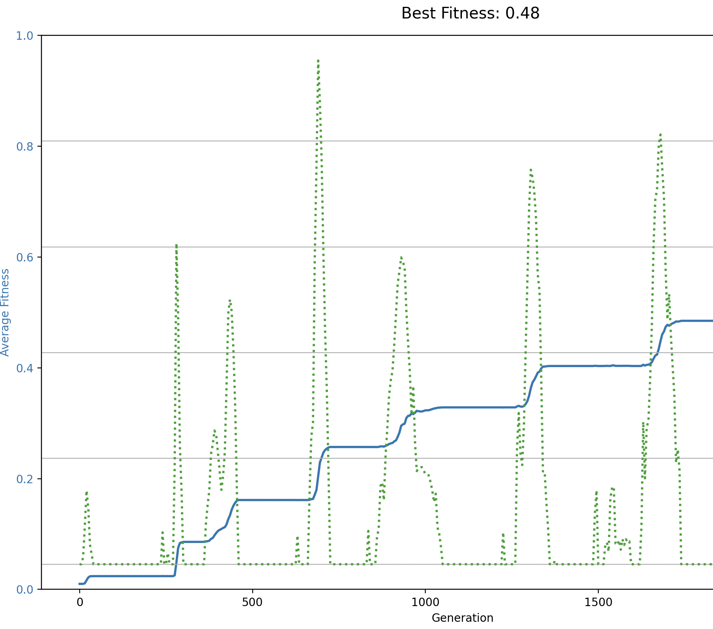

---
params:
  show_answers: false
---

# Genotypes and phenotypes

## Overview: From fitness numbers to folded RNA

In practical 1, you studied evolution where fitness was just a simple **number** (0-1). But real organisms don't have abstract fitness values; their fitness comes from their **physical and chemical properties**. This practical builds a bridge from abstract models to real biology by exploring how genotypes (DNA sequences) translate into phenotypes (proteins and RNA structures) that then determine fitness. 

We'll progress through increasing biological realism:

1. **Fitness as a number**, where we left of last time. 
2. **DNA sequences**, individuals are DNA strings evolving toward a target sequence.
3. **Proteins**, individuals are DNA strings that translate into target protein sequences. Now the genotype is no longer what is directly selected on! 
4. **RNA with structure** — Use the Vienna package to fold RNA and see how these structures evolve. Fitness depends on whether the structure matches a target-fold.

This progression shows why the **genotype-phenotype mapping** is so important in evolution. A small DNA change might have no effect on the protein (silent mutation), a big effect, or even a beneficial effect. You'll find that evolution can "explore" this large genotype space in quite surprising ways.

Let's start:

## Part 1: Fitness as a number 

Copy the code below. Notice that `calculate_diversity()` is **empty** — it just returns 0. Your job is to fill it in! The diversity line is already plotted, waiting for you to implement the function so it will track the diversity within the population. 

:::{.callout-note collapse=true}

## Starting code: Simple Moran with empty diversity function

```python
import random
import math
import matplotlib.pyplot as plt

random.seed(42)

# --- PARAMETERS ---
population_size = 500
generations = 200000
mutation_rate = 0.001
no_reproduction_chance = 1
sample_interval = 100

# --- SETUP ---
def mutate(fitness):
    if random.random() < mutation_rate:
        return min(1.0, max(0.0, fitness + random.uniform(-0.1, 0.1)))
    return fitness

def calculate_diversity(population):
    """Calculate diversity of the population - NOT YET IMPLEMENTED!"""
    return 0

# Initialize
population = [0.1] * population_size
avg_fitness = []
diversity_over_time = []

# Plotting
fig, ax1 = plt.subplots(figsize=(12, 6))

# Left axis: fitness
ax1.set_xlabel("Generation")
ax1.set_ylabel("Average Fitness", color='tab:blue')
ax1.set_ylim(0, 1)
line1, = ax1.plot([], [], color='tab:blue', linewidth=2, label='Fitness')
ax1.tick_params(axis='y', labelcolor='tab:blue')

# Right axis: diversity
ax2 = ax1.twinx()
ax2.set_ylabel("Diversity", color='tab:green')
line2, = ax2.plot([], [], color='tab:green', linestyle=':', linewidth=2, label='Diversity')
ax2.tick_params(axis='y', labelcolor='tab:green')

fig.suptitle("Evolution of Fitness and Diversity")
fig.tight_layout()
fig.legend(loc='upper right')
plt.grid(True)
plt.ion()

# --- EVOLUTION LOOP ---
for gen in range(generations):
    best = max(population)

    # Moran process: roulette wheel with no-reproduction option
    competitors_with_dummy = list(range(population_size)) + [None]
    probs = population + [no_reproduction_chance]

    winner = random.choices(competitors_with_dummy, weights=probs, k=1)[0]

    if winner is not None:
        dead_idx = random.randint(0, population_size - 1)
        population[dead_idx] = mutate(population[winner])

    # Sample and plot
    if gen % sample_interval == 0:
        avg_fitness.append(sum(population) / population_size)
        diversity_over_time.append(calculate_diversity(population))

        x_vals = [i * sample_interval for i in range(len(avg_fitness))]

        line1.set_data(x_vals, avg_fitness)
        line2.set_data(x_vals, diversity_over_time)
        ax1.relim()
        ax1.autoscale_view()
        ax2.relim()
        ax2.autoscale_view()

        fig.suptitle(f"Generation {gen}: Best Fitness = {best:.3f}")
        plt.pause(0.001)

plt.show()
```

:::

## Diversity patterns

Diversity is an important component of evolution; it's the fuel on which selection acts. But diversity can be measured at meany levels. Let's think about this for a bit, by modifying the code above. 

:::{#exr-diversitydynamics}
## The dynamics of diversity - Biology
<br>

Modify the function `calculate_diversity` to calculate the diversity of the population by taking the standard deviation of the fitness values.

a. Use the standard (low) mutation rate and study the dynamics of diversity. Describe the pattern verbally. 
:::

:::{.content-visible when-meta="params.show_answers"}
> **Answer**<br>
> A snippet to calculate the standard deviation of a population is shown below. Note that this value is already being plotted, so if you modify this function you ought to be able to see what happens immediately. 
>```python
>def calculate_diversity(population):
>    """Calculate diversity as the standard deviation of fitness values."""
>    mean = sum(population) / len(population)
>    variance = sum((x - mean) ** 2 for x in population) / (len(population) - 1)
>    return math.sqrt(variance)
>```
> a. The green dotted line is the standard deviation of the values in the population ('diversity'). From this we can see that the population is only briefly diverse whenever a new, fit individual appears. In between these phases, diversity is 0. This makes intuitive (biological) sense, as with a low mutation rate the only moments where there is more than 1 species is during the invasion of a new mutant. During all other phases, there is just a single (fittest) species. 
>
:::

## Evolving a DNA sequence

A big problem with the previous model is there is no true distinction between genotype (that which mutates) and phenotype (that which is selected). Let us try and adapt the model to be more biologically meaningful, by making each individual represented by a DNA sequence. For this, copy the code below^[Note that the code is getting longer and longer. Later in the course, we will also show you how code can be organised across files/folders]:

:::{.callout-note collapse=true}

## Starting code for "evolving a DNA sequence"

```python
import random
import math
import matplotlib.pyplot as plt
from collections import Counter

# set the random number seed
random.seed(0)

plt.ion()  # Enable interactive mode

# Parameters
alphabet = "ATCG"
target_sequence = "GATGCGCGCTGGATTAAC"  # Example target sequence
dna_length = len(target_sequence)
target_length = len(target_sequence)

# Simulation settings
population_size = 500
generations = 20000
mutation_rate = 0.00001
sample_interval = 10  
sample_size = 10  
no_reproduction_chance = 0.1

# Core functions
def fitness(dna):
    """Calculate fitness as % of correct bases"""
    matches = 0
    for i in range(len(dna)):
        if dna[i] == target_sequence[i]:
            matches += 1
    return matches / target_length

def mutate(dna, rate=mutation_rate):
    return ''.join(
        random.choice([b for b in alphabet if b != base]) if random.random() < rate else base
        for base in dna
    )

def count_beneficial_mutations(dna, num_tests=100):
    """Test random mutations (faster than testing all possibilities)"""
    f0 = fitness(dna)
    count = 0
    for _ in range(num_tests):
        i = random.randint(0, len(dna) - 1)
        b = random.choice([x for x in alphabet if x != dna[i]])
        mutant = dna[:i] + b + dna[i+1:]
        if fitness(mutant) > f0:
            count += 1
    # Extrapolate: if 10 out of 100 random tests were beneficial,
    # estimate ~(10/100) * (len(dna) * 3 bases) = total beneficial mutations
    total_possible = len(dna) * 3
    return count * (total_possible / num_tests)

def diversity(pop):
    counts = {}
    for ind in pop:
        counts[ind] = counts.get(ind, 0) + 1
    total = len(pop)
    return -sum((c/total) * math.log(c/total + 1e-9) for c in counts.values()) if total > 0 else 0

# Initialize population
initial_sequence = "GATAGCGAAGTTTAGCCG" # far from target (only first 3 are correct)
population = [initial_sequence for _ in range(population_size)]

avg_fitness = []
avg_beneficial = []
diversity_over_time = []
best_individuals = []

# Initialize interactive plot
fig, ax1 = plt.subplots(figsize=(12, 8))
ax1.set_xlabel("Generation")
ax1.set_ylabel("Average Fitness", color='tab:blue')
ax1.set_ylim(0, 1)
line1, = ax1.plot([], [], color='tab:blue', linewidth=2, label='Fitness')
ax1.tick_params(axis='y', labelcolor='tab:blue')

ax2 = ax1.twinx()
ax2.set_ylabel("Beneficial Mutations / Diversity", color='tab:purple')
line2, = ax2.plot([], [], color='tab:purple', linestyle='--', linewidth=2, label='Beneficial Mutations')
line3, = ax2.plot([], [], color='tab:green', linestyle=':', linewidth=2, label='Diversity')
ax2.tick_params(axis='y', labelcolor='tab:purple')
fig.suptitle("Evolution Toward Target Sequence")
fig.tight_layout()
ax2.set_ylim(0, 20)
fig.legend(loc='upper right')
plt.grid(True)
plt.draw()

# Keyboard controls
paused = False
quit_sim = False

def on_key(event):
    global paused, quit_sim
    if event.key == ' ':  # Spacebar
        paused = not paused
        status = "PAUSED" if paused else "RUNNING"
        fig.suptitle(f"Evolution Toward Target Sequence - {status}\n(Press SPACE to pause, Q to quit)", fontsize=10)
        plt.draw()
    elif event.key.lower() == 'q':  # Q key
        quit_sim = True
        plt.close()

fig.suptitle("Evolution Toward Target Sequence\n(Press SPACE to pause, Q to quit)", fontsize=10)
fig.canvas.mpl_connect('key_press_event', on_key)

best_seq = ""
best_score = -1
found = False

# Evolution loop
for gen in range(generations):
    if quit_sim:
        break

    # Pause handling
    while paused and not quit_sim:
        plt.pause(0.1)
    fitnesses = [fitness(ind) for ind in population]
    total_fit = sum(fitnesses)
    best = max(fitnesses)
    if(best == 1 and not found):
        found = True
        print("Found perfect solution at generation", gen)
        
    avg_fitness.append(sum(fitness(ind) for ind in population) / population_size)

    if gen % sample_interval == 0:
        sample = random.sample(population, sample_size)
        avg_beneficial.append(sum(count_beneficial_mutations(ind) for ind in sample) / sample_size)
        diversity_over_time.append(diversity(population))

        # Update plot data (only plot the sampled data points)
        x_sample = [i * sample_interval for i in range(len(avg_beneficial))]
        x_all = list(range(len(avg_fitness)))

        line1.set_data(x_all, avg_fitness)
        line2.set_data(x_sample, avg_beneficial)
        line3.set_data(x_sample, diversity_over_time)
        ax1.relim(); ax1.autoscale_view()
        ax2.relim(); ax2.autoscale_view()
        best = max(population, key=fitness)
        fig.suptitle(f"Best: {best} (target: {target_sequence})\n(Press SPACE to pause, Q to quit)", fontsize=10)
        plt.pause(0.001)

    # Tournament selection (as in evolving_fitness_final.py)
    new_pop = []
    num_competitors = 10  # can be adjusted

    for _ in range(population_size):
        # Select num_competitors individuals randomly
        competitors = random.sample(population, num_competitors)
        # Pick the one with highest fitness
        fitness_values = [fitness(ind) for ind in competitors]
        total = sum(fitness_values)
        
        probs = [f / total for f in fitness_values]
        winner = random.choices(competitors, weights=probs, k=1)[0]
        # Mutate winner to produce offspring
        offspring = mutate(winner)
        new_pop.append(offspring)

    population = new_pop

    if gen % 250 == 0:
        best = max(population, key=fitness)
        best_individuals.append((gen, best))

plt.show()
```
::::

Answer the following questions using the options available in the model:

:::{#exr-evolving-dna}

## Evolving DNA - Biology / abstract thinking
   a. Run the code. What does the new (dashed blue) line represent? Do you understand how it changes over time?

   The program reports after how many generations it manages to find the target sequence. With default settings this can take a long time... so you may never see the print

   b. Try increasing the mutation rate to see how it affects the time to find the target sequence. Try mutation rates between 0.0001 and 0.1. Keep track of both how long (number of generations) it takes to find the target, and how fit the population is once the target is found. What do you observe?
   c. Diversity is no longer calculated as the standard deviation in fitness, but as the Shannon diversity of all present sequences (although it is not super complex, you do not need to fully understand this function). Because of this, the exact number (quantities) cannot be compared to our earlier model. However, do you see a *qualitative* differences?
d. Study how fitness is calculated in this model. Is there a distinction between genotype en phenotype? Why/why not?

:::

:::{.content-visible when-meta="params.show_answers"}
> **Answer**<br>
a. The new blue dotted line represents how many mutations are beneficial (towards the target). As the population gets closer to the target, the number of beneficial mutations decreases. As such, this line is a mirror image of the fitness in the population. We will look a bit deeper into this line in the next model. <br>
b. Generally speaking, a higher mutation rate helps to find the target faster. However, with high mutation rates (0.01 or higher), the fitness after the target is found starts to decrease, as individual produce many (unfit) mutants. In fact, if mutation rate is too high (approximately 0.04 or higher), the population fails to find the target at all, as reproduction is too inaccurate! This concept is known as the 'Error Threshold' or the 'Error Catastrophe' in evolutionary biology. <br>
c. Qualitatively, there is no clear difference to what we saw before. Before we saw that, with low mutation rates, diversity only peaks at moments when there is a new mutant coming in. This is still the same. 
d. There is no distinction between genotype and phenotype. Fitness is directly calculated from the DNA sequence, so there is no 'genotype-to-phenotype mapping'. <br>
:::

## Evolving a protein sequence

Next we will extend the simulation a little more. The individual genotypes will still be represented as a DNA sequence, but before evaluating fitness this will be translated into a **protein** sequence. To do so, the code first defines the codon table (which we of course all know by heart =)), and then translates the DNA sequence into a protein sequence. The protein sequence is then used to calculate the fitness of the individual, which is based on how well the protein sequence matches a target protein sequence. The code is as follows:

:::{.callout-note collapse=true}

## Starting code for evolving a protein sequence

```python
import random
import math
import matplotlib.pyplot as plt
from collections import Counter

# set the random number seed
random.seed(0)

plt.ion()  # Enable interactive mode

# Codon table
codon_table = {
    'TTT': 'F', 'TTC': 'F', 'TTA': 'L', 'TTG': 'L', 'CTT': 'L', 'CTC': 'L', 'CTA': 'L', 'CTG': 'L',
    'ATT': 'I', 'ATC': 'I', 'ATA': 'I', 'ATG': 'M',
    'GTT': 'V', 'GTC': 'V', 'GTA': 'V', 'GTG': 'V',
    'TCT': 'S', 'TCC': 'S', 'TCA': 'S', 'TCG': 'S', 'AGT': 'S', 'AGC': 'S',
    'CCT': 'P', 'CCC': 'P', 'CCA': 'P', 'CCG': 'P',
    'ACT': 'T', 'ACC': 'T', 'ACA': 'T', 'ACG': 'T',
    'GCT': 'A', 'GCC': 'A', 'GCA': 'A', 'GCG': 'A',
    'TAT': 'Y', 'TAC': 'Y', 'CAT': 'H', 'CAC': 'H',
    'CAA': 'Q', 'CAG': 'Q', 'AAT': 'N', 'AAC': 'N',
    'AAA': 'K', 'AAG': 'K', 'GAT': 'D', 'GAC': 'D',
    'GAA': 'E', 'GAG': 'E', 'TGT': 'C', 'TGC': 'C',
    'TGG': 'W', 'CGT': 'R', 'CGC': 'R', 'CGA': 'R', 'CGG': 'R', 'AGA': 'R', 'AGG': 'R',
    'GGT': 'G', 'GGC': 'G', 'GGA': 'G', 'GGG': 'G',
    'TAA': '*', 'TAG': '*', 'TGA': '*'
}

# Parameters
alphabet = "ATCG"
target_protein = "DARWIN"
dna_length = len(target_protein)*3
target_length = len(target_protein)

# Simulation settings
population_size = 625  # must be a square number for grid mode
generations = 20000
mutation_rate = 0.0005   
sample_interval = 5
sample_size = population_size
no_reproduction_chance = 0.01

# Core functions
def translate(dna):
    return ''.join(codon_table.get(dna[i:i+3], '?') for i in range(0, len(dna), 3))

def fitness(dna):
    protein = translate(dna)
    matches = 0
    for i in range(len(protein)):
        if protein[i] == target_protein[i]:
            matches += 1
    return matches / target_length

def mutate(dna, rate=mutation_rate):
    return ''.join(
        random.choice([b for b in alphabet if b != base]) if random.random() < rate else base
        for base in dna
    )

def count_beneficial_mutations(dna, num_tests=100):
    """Test random mutations (faster than testing all possibilities)"""
    f0 = fitness(dna)
    count = 0
    for _ in range(num_tests):
        i = random.randint(0, len(dna) - 1)
        b = random.choice([x for x in alphabet if x != dna[i]])
        mutant = dna[:i] + b + dna[i+1:]
        if fitness(mutant) > f0:
            count += 1
    # Extrapolate: if 10 out of 100 random tests were beneficial,
    # estimate ~(10/100) * (len(dna) * 3 bases) = total beneficial mutations
    total_possible = len(dna) * 3
    return count * (total_possible / num_tests)

def diversity(pop):
    counts = Counter(pop)
    total = len(pop)
    return -sum((c/total) * math.log(c/total + 1e-9) for c in counts.values()) if total > 0 else 0

# Initialize population
initial_sequence = ''.join(random.choice(alphabet) for _ in range(dna_length))
population = [initial_sequence for _ in range(population_size)]

avg_fitness = []
avg_beneficial = []
diversity_over_time = []
best_individuals = []

# Grid setup
side = int(math.sqrt(population_size))
assert side * side == population_size, "Population size must be a square number for grid mode"

def get_neighbors(i, j):
    return [(x % side, y % side)
            for x in range(i-1, i+2)
            for y in range(j-1, j+2)]

# Initialize interactive plot
fig, ax1 = plt.subplots(figsize=(12, 8))
ax1.set_xlabel("Generation")
ax1.set_ylabel("Average Fitness", color='tab:blue')
ax1.set_ylim(0, 1)
line0, = ax1.plot([], [], color='black', linewidth=1, label='Max fitness')
line1, = ax1.plot([], [], color='tab:blue', linewidth=2, label='Fitness')
ax1.tick_params(axis='y', labelcolor='tab:blue')

ax2 = ax1.twinx()
ax2.set_ylabel("Beneficial Mutations / Diversity", color='tab:purple')
line2, = ax2.plot([], [], color='tab:purple', linestyle='--', linewidth=2, label='Beneficial Mutations')
line3, = ax2.plot([], [], color='tab:green', linestyle=':', linewidth=2, label='Diversity')
ax2.tick_params(axis='y', labelcolor='tab:purple')
fig.suptitle("Evolution Toward " + str(target_protein))
fig.tight_layout()
ax2.set_ylim(0, 5)
fig.legend(loc='upper right')
plt.grid(True)
plt.draw()

# Keyboard controls
paused = False
quit_sim = False

def on_key(event):
    global paused, quit_sim
    if event.key == ' ':  # Spacebar
        paused = not paused
        status = "PAUSED" if paused else "RUNNING"
        fig.suptitle(f"Evolution Toward {target_protein} - {status}\n(Press SPACE to pause, Q to quit)", fontsize=10)
        plt.draw()
    elif event.key.lower() == 'q':  # Q key
        quit_sim = True
        plt.close()

fig.suptitle(f"Evolution Toward {target_protein}\n(Press SPACE to pause, Q to quit)", fontsize=10)
fig.canvas.mpl_connect('key_press_event', on_key)

best_seq = ""
best_score = -1
best_fitnesses = []
found = False

# Evolution loop
for gen in range(generations):
    if quit_sim:
        break

    # Pause handling
    while paused and not quit_sim:
        plt.pause(0.1)

    fitnesses = [fitness(ind) for ind in population]
    total_fit = sum(fitnesses)
    best = max(fitnesses)
    best_fitnesses.append(best)
    if(best == 1 and not found):
        found = True
        print("Found perfect solution at generation", gen)
        
    if gen % sample_interval == 0:
        sample = random.sample(population, sample_size)
        avg_beneficial.append(sum(count_beneficial_mutations(ind) for ind in sample) / sample_size)
        diversity_over_time.append(diversity(population))

        # Update plot data
        line0.set_data(range(len(avg_fitness)+1), best_fitnesses)
        line1.set_data(range(len(avg_fitness)+1), avg_fitness + [sum(fitnesses)/population_size])
        line2.set_data(range(len(avg_beneficial)), avg_beneficial)
        line3.set_data(range(len(diversity_over_time)), diversity_over_time)
        ax1.relim(); ax1.autoscale_view()
        ax2.relim(); ax2.autoscale_view()
        best = max(population, key=fitness)
        fig.suptitle(f"Best: {translate(best)} (target: {target_protein})\n(Press SPACE to pause, Q to quit)", fontsize=10)
        plt.pause(0.01)

    else:
        avg_beneficial.append(avg_beneficial[-1])
        diversity_over_time.append(diversity_over_time[-1])

    new_pop = []
    num_competitors = 10  # can be adjusted

    for _ in range(population_size):
        # Select num_competitors individuals randomly
        competitors = random.sample(population, num_competitors)
        # Pick the one with highest fitness
        fitness_values = [fitness(ind) for ind in competitors]
        total = sum(fitness_values)
        
        probs = [f / total for f in fitness_values]
        winner = random.choices(competitors, weights=probs, k=1)[0]
        # Mutate winner to produce offspring
        offspring = mutate(winner)
        new_pop.append(offspring)

    population = new_pop


    avg_fitness.append(sum(fitness(ind) for ind in population) / population_size)
    if gen % 250 == 0:
        best = max(population, key=fitness)
        best_individuals.append((gen, translate(best)))

plt.show()

```
::::

Answer the following question about the model:

:::{#exr-evolving-proteins}

## Evolving protein sequences - Biology / abstract thinking

a. Another line was added to the model. What new information can you obtain from analysing this line?
b. Study carefully how the other lines (also present in previous models) change over time. What do you observe? Try and capture what you see into words. 
c. In biology, multiple genotypes can translate to the same phenotype (this is called a many-to-one genotype-phenotype map), or alternatively, one genotype can produce multiple phenotype (this is called phenotypic plasticity, or a one-to-many genotype-phenotype map). Which genotype-phenotype (GP) mapping applies to this model? Why?
:::

:::{.content-visible when-meta="params.show_answers"}
> **Answer**<br>
a. The new black line is the maximum fitness in the population. Thanks to this line we can see that, sometimes, an individual is present that is fitter but it does not manage to take over the population. We are dealing with a stochastic process, so this is very natural. <br>
b. The fitness line once again goes in distinct steps. The diversity line (green dotted) has a distinct behaviour compared to earlier models. Instead of only going up during the discovery of a new mutant, it constantly creeps up during periods where fitness does not change. This is because the codon-table is partially redundant: many different DNA sequences can code for the same amino acid sequence, so diveristy increases. However, when a new "fitter" individual comes in, diversity goes down as that individual clonally takes over the population. Then, diversity slowly increases again. A similar pattern is reflected in the line that represents the "beneficial mutations" (blue dotted line). TLDR; even when fitness is not changing there is still a lot going on in this population!<br>
c. This model represents a many-to-one mapping between genotype and phenotype. The DNA sequence (genotype) is translated into an amino acid sequence (phenotype), which is then used to calculate fitness. This means that many different genotypes can lead to the same phenotype, and thus the same fitness. Earlier in this course you have learned about development, and those processes often lead to effects where the same genotype can produce many different shapes (phenotypes).
:::

## Part 4: RNA structure evolution

Now we'll take the genotype-phenotype map even further. RNA sequences fold into **3D structures** that determine function. The genotype is a sequence, the phenotype is a structure, and fitness depends on how well that structure does its job.

First, you need to install the ViennaRNA package. This is a real bioinformatics tool used by researchers to determine how RNA folds. 

### Installing ViennaRNA

**What is pip?** Pip is the Python package manager, it downloads and installs Python libraries. You already have it if you have Python.

**Install ViennaRNA:**
Open a terminal and run:
```bash
pip install ViennaRNA
```

This will not take super long. If it fails, try `pip3 install ViennaRNA` instead.

### Test if it works

Copy this code into a Python file and run it:

```python
from RNA import fold

rna_sequence = "GCGCUUCGAGAGAGGATAGCATCGCCG"
structure, energy = fold(rna_sequence)
print("Sequence:", rna_sequence)
print("Structure:", structure)
print("Energy:", energy)
```

You should see something like:
```
Sequence: GCGCUUCGAGAGAGGATAGCATCGCCG
Structure: ((.((((....))))...)).......
Energy: -4.599999904632568
```

The dots and parentheses are a simple way to show the 2D fold of an RNA molecule. Brackets show the maching base pairs, and dots are unpaired bases. 

:::{#exr-rna-evolution}

## Evolving RNA structures - Coding practice

Use the same evolution framework as in Parts 2 and 3, but instead of comparing sequences or proteins, **compare RNA structures**. Fitness = how brackets/dots are matching, rather than comparing the nucleotides directly. For example, if your target is `((((....))))` and your RNA folds to `((((....))))`, fitness = 1.0. If it matches 10 out of 12 positions, fitness = 10/12 ≈ 0.833, *etc.* 

Start with a random RNA sequence of length 32, and try to evolve it to match a target secondary structure. To find a possible target structure, you can fold another random sequence, and define this as the end-target.

Try alternating between two different target structures, and describe what you observe (if anything, I personally don't know if anything exciting happens). 

:::

**Hint:** Structure comparison is quite simple:
```python
def structure_fitness(rna_seq, target_structure):
    structure, _ = fold(rna_seq) 
    
    # Count how many positions match the target
    matches = 0
    for i in range(len(structure)):
        if structure[i] == target_structure[i]:
            matches += 1
    
    return matches / len(target_structure)
```

:::{.content-visible when-meta="params.show_answers"}
> **Answer: Full code with alternating targets**
> ```python
> from RNA import fold
> import random
> import math
> import matplotlib.pyplot as plt
> from collections import Counter
>
> random.seed(23)
> plt.ion()
>
> # Generate target structures by folding random sequences
> rna_length = 24
> alphabet = "ACGU"
> random_seq_1 = ''.join(random.choice(alphabet) for _ in range(rna_length))
> random_seq_2 = ''.join(random.choice(alphabet) for _ in range(rna_length))
> target_1, _ = fold(random_seq_1)
> target_2, _ = fold(random_seq_2)
>
> print(target_1)
> print(target_2)
>
> # Simulation settings
> population_size = 200
> generations = 100990
> mutation_rate = 0.0005
> sample_interval = 10
> switch_interval = 500  # Switch targets every 500 generations
>
> def mutate(rna):
>     return ''.join(
>         random.choice([b for b in alphabet if b != base]) if random.random() < mutation_rate else base
>         for base in rna
>     )
>
> def structure_fitness(rna_seq, gen):
>     structure, _ = fold(rna_seq)
>
>     # Alternate targets
>     if (gen // switch_interval) % 2 == 0:
>         target = target_1
>     else:
>         target = target_2
>
>     # Count mismatches (distance)
>     mismatches = 0
>     compare_len = min(len(structure), len(target))
>     for i in range(compare_len):
>         if structure[i] != target[i]:
>             mismatches += 1
>
>     return mismatches / len(target)
>
> def diversity(pop):
>     counts = Counter(pop)
>     total = len(pop)
>     return -sum((c/total) * math.log(c/total + 1e-9) for c in counts.values()) if total > 0 else 0
>
> # Initialize population as clones of one random sequence
> initial_seq = ''.join(random.choice(alphabet) for _ in range(rna_length))
> population = [initial_seq for _ in range(population_size)]
>
> avg_fitness = []
> max_fitness = []
> diversity_over_time = []
>
> # Setup plot
> fig, ax1 = plt.subplots(figsize=(12, 6))
> ax1.set_xlabel("Generation")
> ax1.set_ylabel("Distance from Target", color='tab:blue')
> ax1.set_ylim(0, 1)
> line_max, = ax1.plot([], [], color='black', linewidth=2, label='Min distance')
> line_avg, = ax1.plot([], [], color='tab:blue', linewidth=2, label='Avg distance')
> ax1.tick_params(axis='y', labelcolor='tab:blue')
> ax1.grid(True)
>
> ax2 = ax1.twinx()
> ax2.set_ylabel("Diversity", color='tab:green')
> line_div, = ax2.plot([], [], color='tab:green', linestyle=':', linewidth=2, label='Diversity')
> ax2.tick_params(axis='y', labelcolor='tab:green')
>
> fig.suptitle("RNA Evolution with Alternating Targets\\n(Press SPACE to pause, Q to quit)")
> fig.tight_layout()
> fig.legend(loc='upper right')
> # Shade initial target A block
> ax1.axvspan(0, switch_interval, color='gray', alpha=0.1, zorder=0)
> plt.draw()
>
> # Keyboard controls
> paused = False
> quit_sim = False
>
> def on_key(event):
>     global paused, quit_sim
>     if event.key == ' ':
>         paused = not paused
>         status = "PAUSED" if paused else "RUNNING"
>         fig.suptitle(f"RNA Evolution - {status}\\n(Press SPACE to pause, Q to quit)")
>         plt.draw()
>     elif event.key.lower() == 'q':
>         quit_sim = True
>         plt.close()
>
> fig.canvas.mpl_connect('key_press_event', on_key)
>
> # Evolution loop
> for gen in range(generations):
>     if quit_sim:
>         break
>
>     while paused and not quit_sim:
>         plt.pause(0.1)
>
>     # Calculate fitness for all
>     fitnesses = [structure_fitness(ind, gen) for ind in population]
>     total_fit = sum(fitnesses)
>
>     # Tournament selection (invert distance so lower distance = higher selection probability)
>     new_pop = []
>     for _ in range(population_size):
>         competitors = random.sample(range(population_size), 10)
>         competitor_fits = [1 - fitnesses[i] for i in competitors]  # Invert distance to fitness
>         total = sum(competitor_fits)
>
>         if total > 0:
>             probs = [f / total for f in competitor_fits]
>         else:
>             probs = [1/10] * 10
>
>         winner_idx = random.choices(competitors, weights=probs)[0]
>         offspring = mutate(population[winner_idx])
>         new_pop.append(offspring)
>
>     population = new_pop
>
>     # Plot update
>     if gen % sample_interval == 0:
>         avg_fitness.append(sum(fitnesses) / population_size)
>         max_fitness.append(min(fitnesses))
>         diversity_over_time.append(diversity(population))
>
>         x = [i * sample_interval for i in range(len(avg_fitness))]
>         line_max.set_data(x, max_fitness)
>         line_avg.set_data(x, avg_fitness)
>         line_div.set_data(x, diversity_over_time)
>
>         # Shade background for target blocks
>         if gen % switch_interval == 0 and gen > 0:
>             # Determine which target this block ends
>             block_num = gen // switch_interval
>             if block_num % 2 == 1:  # Shade target A blocks (even block numbers = target A)
>                 ax1.axvspan(gen - switch_interval, gen, color='gray', alpha=0.1, zorder=0)
>
>         ax1.relim()
>         ax1.autoscale_view()
>         ax2.relim()
>         ax2.autoscale_view()
>
>         current_target = target_1 if (gen // switch_interval) % 2 == 0 else target_2
>         fig.suptitle(f"Gen {gen}: Target = {current_target}\\n(Press SPACE to pause, Q to quit)")
>         plt.pause(0.001)
>
> plt.show()
> ```
>
> **What you should observe:** The fitness line plateaus as it evolves toward one target, then drops when the target switches, then climbs again. This shows real biology—populations adapting to changing environments can lose fitness during transitions. But here's the really interesting part: sometimes the switching appears to be much easier, and sometimes much harder! Notice the diversity line—when there's more genetic diversity in the population, it can adapt faster to new targets. When diversity is low, adaptation is slow. This is why genetic diversity is so valuable in evolution!
:::

