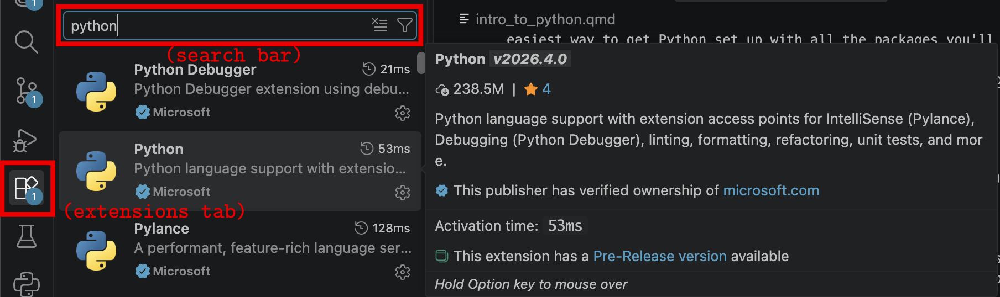

---
execute:
  echo: true
  eval: false
engine: knitr
---



# 0) Introduction to Python {.unnumbered}

This introductory part is about Python; probably the most popular programming language in science. During the course you will be able to interact with code snippets, and copy/paste code from this website into your own setup. Both are briefly explained here. 

## Python-snippets in the browser

Although you will mostly be using your own setup to work with Python (explained below), we will sometimes share short code snippets directly in the browser, like the ones below. You can run them, modify them, and get a feeling for the code. 

```{pyodide}
name = "Tina"
age = 25
print(f"{name} is {age} years old")
```

```{pyodide}
x = 10
y = 20
print(f"Sum: {x + y}")
print(f"Product: {x * y}")
```

```{pyodide}
numbers = [1, 2, 3, 4, 5]
for num in numbers:
    print(f"Number: {num}, Squared: {num**2}")
```

```{pyodide}
import numpy as np
import matplotlib.pyplot as plt

x = np.linspace(0, 10, 100)
y = np.sin(x)

plt.figure(figsize=(8, 4))
plt.plot(x, y, 'b-', linewidth=2)
plt.title("Sine Wave")
plt.xlabel("x")
plt.ylabel("sin(x)")
plt.grid(True)
plt.show()
```

But as said, for the actual course work, simulations, and graphics, you'll use your local Python setup with Anaconda and VS Code. It's a lot more practical for bigger projects. So let's get that installed. 


## Installing Python via Anaconda

Anaconda is a free and open-source distribution of Python for scientific computing. It's the easiest way to get Python set up with all the packages you'll need for this course.

[Download Anaconda from this page](https://www.anaconda.com/download/success) and follow the installation instructions. After installing, you now have:

-	Python
- Most scientific packages like numpy, matplotlib, and pandas
- Conda and pip (for installing additional packages if needed)

## Setting up Visual Studio Code

The recommended editor^[You can of course use whatever you wish if you're an experienced programmer with opinions.] for this course is Visual Studio Code (VS Code). To set it up:

1. Download and install VS Code from [https://code.visualstudio.com/download](https://code.visualstudio.com/download)
2. Open VS Code and install the **Python extension** (search for 'Python' in the extensions tab on the left, and install the one with the blue check mark) 
3. Select the Python interpreter from Anaconda:
   - Press `Ctrl+Shift+P` (or `Cmd+Shift+P` on Mac) to open the command palette
   - Search for `Python: Select Interpreter (you don't need to type in the whole phrase) and choose the python path that points to your Anaconda installation (it should have 'anaconda3' in the path)


Now you're ready to run Python scripts!


## Testing your setup

Throughout this course you will work with scripts you've been given or that you can copy/paste from this website. Let's test your setup with the script below. Copy it to your VSC, save it somewhere (e.g. as `myFirstScript.py`), and try to run it by hitting the 'play' button above your script, or by typing `python myFirstScript.py`^[The `python` command calls your Python interpreter. On Windows with Anaconda, this usually works automatically. On Mac/Linux, you may need to use `python3` instead. If that doesn't work, you may need to add Anaconda to your system PATH (this tells your terminal where to find Python). During Anaconda installation, there's usually an option to "Add Anaconda to my PATH" — select it. See [this guide](https://docs.conda.io/projects/conda/en/latest/user-guide/install/linux.html) for details.] in a terminal.

```python
import random, matplotlib.pyplot as plt

plt.ion()
fig, ax = plt.subplots()
ax.set_ylim(-2, 2)
ax.set_xlim(0, 100)
ax.set_title("Random Wiggle Test")
line, = ax.plot([], [], color="seagreen", lw=2)

y = [0]
for i in range(100):
    y.append(y[-1] + random.uniform(-0.1, 0.1))  # random wiggle
    line.set_data(range(len(y)), y)
    ax.set_xlim(0, len(y))
    plt.pause(0.03)

ax.set_title("Animation works! (you can close this window)")
plt.ioff()
plt.show()
```

Save this as a `.py` file in VS Code and run it by pressing `F5` or using the "Run" button in the top right. Does the animation show up in a separate window and is it animated? Good, you're ready to go! 
    
# Introduction to Python Programming

This document provides a brief introduction to Python programming. It covers basic concepts such as variables, data types, control structures, functions, and libraries. 

## Variables and Data Types

In Python, variables are used to store data. You can create a variable by assigning a value to it using the `=` operator. For example:
```python
x = 10
y = "Hello, World!"
```
Python has many built-in data types, including:

- Integers (`int`): Whole numbers, e.g., `10`, `-5`
- Floating-point numbers (`float`): Decimal numbers, e.g., `3.14`, `-0.001`
- Strings (`str`): Text, e.g., `"Hello"`, `'Python'`
- Booleans (`bool`): True or False values, e.g., `True`, `False`
- Lists (`list`): Ordered collections of items, e.g., `[1, 2, 3]`, `['a', 'b', 'c']`
- Dictionaries (`dict`): Key-value pairs, e.g., `{'name': 'Bram', 'age': 67}`
- And many more 

## Using comments 

By using a `#` in your code, you can type 'comments' to explain your code, like this:

```python
age = 10     # age of rabbit in months
y = "Brown"  # colour of rabbit
```

## Control Structures

Control structures allow you to control the flow of your program. Common control structures in Python include: 

### Conditional statements (`if`, `elif`, `else`)

```python
if x > 0:
    print("x is positive")
elif x == 0:
    print("x is zero")
else:
    print("x is negative")
```

You can run the code given above using the interfact below. What happens? Can you fix that?

```{pyodide}
if x > 0:
    print("x is positive")
elif x == 0:
    print("x is zero")
else:
    print("x is negative")
```

### Loops (`for`, `while`):
```python
for i in range(5):
    print(i)
count = 0

while count < 5:
    print(count)
    count += 1
```

For loops repeat within a defined range (above, there are 5 repetitions). While loops will run for however long the conditions are still true, so you needs to make sure the conditions to stop the loop are there, otherwise you'll have defined an infinite loop! With that in mind, look at the script below, which only has a 'count' variable set to 10. Try writing a while loop that counts down from 10, and stops counting at 0.

```{pyodide}
count = 10
```

## Functions

Functions are reusable blocks of code that perform a specific task. You can define a function using the `def` keyword: 

```python
def greet(name):
    return f"Hello, {name}!"

# calling function:    
greet("Agnes")
```

Below is an example of a function with multiple arguments, and where a simple calculation happens within the function call. But... it is not yet being called. Try calling the function with your own name and age. 

```{pyodide}
def greet(name, age):
    months = age * 12
    return (f"Hello, {name}! I heard you are {age} years old! "
            f"That is at least {months} months :)")

# call the function yourself: 
```

## Libraries

Python has a rich ecosystem of libraries that extend its functionality. Most scientific packages are shipped with Anaconda, so you don't need to worry about these. These
include: 

- NumPy: For numerical computing
- Pandas: For data manipulation and analysis
- Matplotlib: For data visualization
- SciPy: For scientific computing

If you need to install other packages, you can use `pip` or `conda` in the terminal. For example, to install the `html5lib` library, open a terminal (or use the terminal in VS Code) and run:

```
pip install html5lib
```

But you probably won't need to install many packages during this course—most scripts use only the packages that come with Anaconda. 

## StudyLens practice

If you've installed Python and read through the basics of Python above, it's time
to dive into the StudyLens exercises. For this, login to [StudyLens](http://studylens.science.uu.nl/) and use the username
and password that was shared with you on Brightspace. 