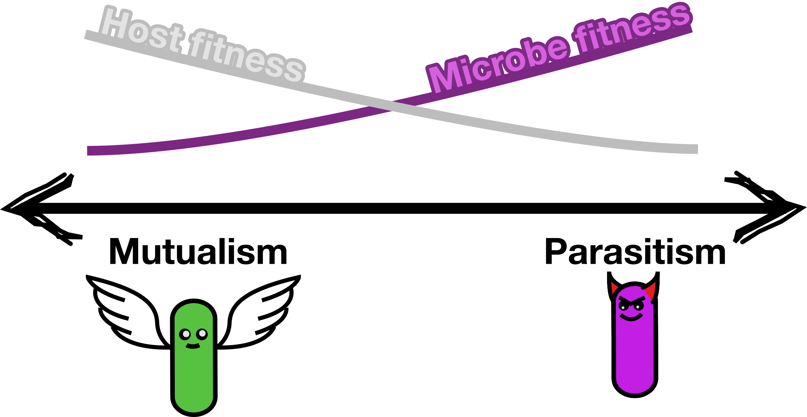

# Miniproject: disease outbreaks in space

## Mini description

Pathogenic microbes face a fundamental trade-off: they benefit from being virulent (extracting more resources from the host), but excessive virulence can kill or severely damage the host, reducing transmission to new hosts. 
This creates **conflicting selection pressures**. 
At the individual pathogen level, natural selection favors parasitism, as you gain more resources where more friendly microbes do not.
But at the host population level, high virulence increases death and may reduce transmission, and can therefore eliminate the pathogen entirely.

To complicate matters further, pathogenic traits—like virulence factors or toxins—can spread between microbial strains through **horizontal gene transfer** (via plasmids, phages, or other mobile genetic elements). 
This means a strain can acquire virulence without evolving it on its own. 
While there is a lot of literature on virulence evolution, this is not often combined with horizontal gene transfer. 
Understanding when virulence evolves or spreads, and what stops it from becoming catastrophically high, is crucial for predicting and preventing disease outbreaks.

{#fig-parmut}

In this mini project, you will investigate how virulence evolves in a microbial population infecting hosts.
We will start with simple ordinary differential equations, but can additionally study these in a spatial model.  

Here are a few key questions to get you started:

## Guiding questions:
 * Study a simple ODE model and study what happens to highly virulent pathogens
 * Extend the model to have two pathogen types, and investigate who will win under what conditions. 
 * Extend the model to include HGT and gene loss. Do your results change? 
 * Study how pathogens evolve in a spatially structured simulation. Which types of pathogens are most succesful?

## Key references

- https://doi.org/10.1111%2Fj.1420-9101.2008.01658.x

## Getting started

Let's build a simple **disease outbreak model** from first principles. We want to track:

Note by Bram: still need to finish this. 

