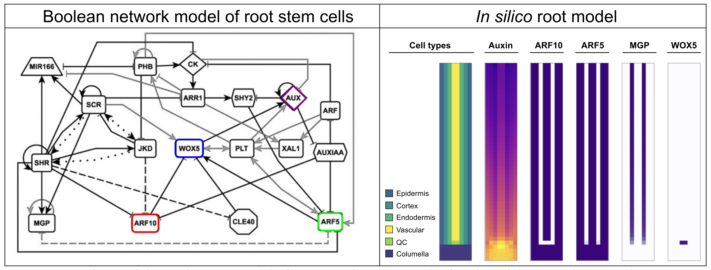

# Miniproject: Auxin, but make it different. 

## Mini description
In practical 6 we learned about auxin, and how it regulates WOX5 in the root. Auxin can move between cells through the activity of membrane proteins acting as auxin efflux and influx transporters,and in the cells, auxin activates a signalling pathway in which a family of transcription factors, the auxin response factors (ARF) regulate gene expression. To study the role of auxin on plant development, experimentalists have found several ways to impinge on the different steps preceding auxin responses. For example, auxin levels can be increased using a synthetic auxin molecule (NAA) or by inhibiting the activity of the PIN transporters (N-1-naphthylphthalamic acid, NPA), while auxin responses can be actively elicited by interfering directly with components the auxin signalling pathway. 

In the root, WOX5 regulation by auxin has been studied using these three strategies. The model we used in Practical 6 makes a rather coarse representation of the auxin treatments by increasing the auxin levels equally in all cells. Yet, the actual treatments made by experimentalists affect auxin levels and responses in very different ways. Here you will extend the model we used in practical 6, to implement each of the strategies and compare how each intervention modifies WOX5 expression in time and space. 

{#vegmini1 width=130%}

## Model extension 
Look at the code and functions of practical 6, specifically at how auxin is currently represented. Propose how you would modify the model to simulate NAA/IAA/NPA treatment. Which functions should you modify? 

## Guiding steps

**Increasing auxin levels in the root apex**

1)	Implement the effect of using a synthetic auxin molecule (NAA) whose transport is not universally PIN-dependent and thus it enhanced signal but no change in spatial pattern (@friml2003efflux). Assume NAA enters the root through the epidermis, to mimic that experimentalists add NAA to the medium where the plant grows.

2) Implement the effect of natural auxin, IAA, treatments. Assume IAA enters the root through the epidermis. IAA transport is PIN-dependent.

3)	Implement the inhibition of PIN efflux transporters when treating plants with NPA (@abas2021naphthylphthalamic). 

-->	Now, simulate single NAA and NPA treatments, and combined NPA+IAA (natural auxin) treatments. You can also simulate other combinations, and make predictions of what would happen. Evaluate in each case how WOX5 is regulated in time and space. Does this match the experiments?

### Guiding questions

* How does each "auxin" treatment affect the spatial pattern of auxin across the cells of the root over time?

* How does WOX5 expression change spatially in response to each treatment?

* Are changes in WOX5 expression immediate or delayed for different perturbations, and why?

* Are these auxin treatments equivalent? In what sense are they (not)?

## For master students

3)	Modify the gene regulatory network function to include the negative feedback from WOX5 to auxin signaling pathway (@tian2014wox5). Specifically to simulate a gain of function of the repressor of the auxin pathway (IAA).

### Guiding questions

* Simulate the experiments in Figure 2 of the paper. For this, you need to include a new regulator in the network (IAA17). 

* What roles do auxin transport and auxin signalling play in regulating gene expression in the Arabidopsis root?

* How do direct perturbations of the auxin signalling pathway (e.g. affecting ARF5, ARF10 or IAA17 activity) differ mechanistically from changes in auxin transport?

## Key references:
-	NPA+IAA treatment, @mahonen2014plethora: <https://www.nature.com/articles/nature13663>
-	NAA treatment, @ding2010auxin: <https://www.pnas.org/doi/10.1073/pnas.1000672107>
-	WOX5 and IAA17, @tian2014wox5: <https://www.cell.com/molecular-plant/fulltext/S1674-2052(14)60288-4>
