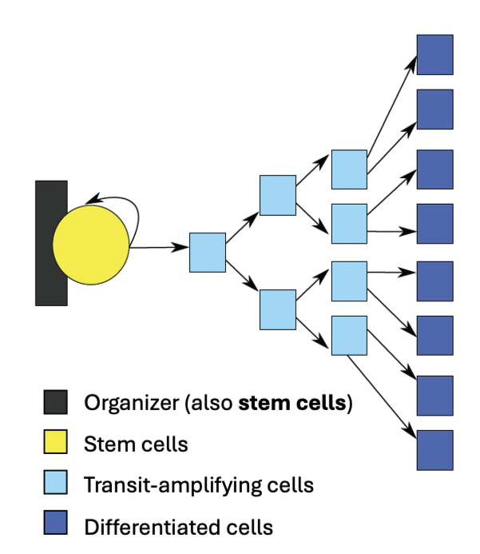
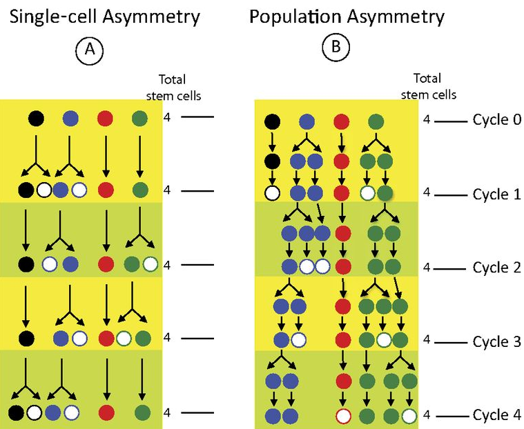

# Miniproject: Oncogenic propensity of stem cell niches 

## Mini description
Stem cells are present in our bodies, and their activity is important for the renewal of our tissues. For example, the turnover of our skin cells is ~30 days, and ~7 days for the gut epidermis, and both are driven by the activity of stem cells housed in microenvironments (stem cell niches). The spatial organization of stem cell niches is generic (even in plants is the same!): stem cells are housed in a niche, they divide asymmetrically to self-renew the stem cell and produce another cell that leaves the niche to divide actively in a transit-amplifying zone, and then differentiates acquiring its functional characteristics. 

Thus, the cells that compose a stem cell niche are organized in compartments, and are different in terms of 1) cell division and 2) differentiation (Figure 1). 

{#p7}

In humans, different tissues have a different propensity of developing cancer, and this could be due to a combination of two factors that together *"create a 'perfect storm' that ultimately determines organ cancer risk”* (@zhu2016multi):

- Differences in stem cell activity: that is how often stem cells divide, and with that the chance of acquiring a mutation in a gene that has the potential to cause cancer. We will call this oncogenic mutations. 

- Extrinsic factors: UV radiation, smoking.

In this mini project you will make a model to explore the effect of differences in stem cell activity, and cancer risk. For this, you will develop a multicellular model simulating the different compartments composing a stem cell niche, to study what is the relation of differences in stem cell activity and cancer risk. 

## Getting started:

- First, think of how you would implement your model: what variables would you use, what functions you need to define, etc. 

- Open the code you got from your supervisor. This code implements a 1D-model of a growing tissue using a grid-based approach. Study the code to see what is implemented, and how.

- The code simulates a homogeneous population of cells, so you need to expand it to simulate asymmetric divisions, the different stem cell niche compartments, and the behaviors in each. 

- Modify the code to implement the differences in cell division per compartment. 

- Include random mutations, and monitor the spread of such mutations through time. 

## Guiding steps: 

Once you have a working model simulating a "normal" stem cell niche, try the following ideas: 

-	Implement a mutation rate probability (e.g. 0.01 per cell per division). Now run the simulation for $t$ time steps, and quantify how many mutations occur in each compartment of the stem cell niche. Which one gets a higher number of mutations?

- Analyse the fate of the mutations occurring in the stem cells and in the proliferating cells

-	Simulate different stem cell activities to mimic different tissues cell renewal. Plot stem cell activity vs number of mutations. 

- Assume the proliferating cells divide more frequently than stem cells (Probabilities: stem cells $0.1$, proliferating cells $0.7$, differentiating cells $0.0$). Compare the cell production of this stem cell niche with this generic organization (Fig. 1) and one where all cells divide at the same frequency. 

- Check various combinations of division probabilities per compartment, fixing 0.0 for the differentiating cells. Is there a combination of division probabilities that can optimize cell production with minimal long-lasting mutation rates? 

### For master-level students: Asymmetric divisions 

Stem cells divide asymmetrically to self-renew and produce cells that will proliferate and differentiate. Asymmetry is important to satisfy these two functions, and it is interesting that there are two ways of achieving such asymmetry. 

a) Single cell asymmetry: Every time a stem cell divides, a stem cell and a differentiated cell are produced. This asymmetry can be achieved by the polarization of molecules prior to the division. 

b) Population asymmetry: Stem cells divide symmetrically meaning they produce two stem cells. The fate of these daughter stem cells is defined stochastically through competition for space in the niche, with the cells leaving the niche differentiating. This means a stem cell division can produce two stem cells, two differentiating cells, or one stem cell and one differentiating cells. Asymmetry is achieved at the population level.

{#p7}

-	Expand the tissue model to a 2D model with the three stem cell niche compartments studied before (Figure 1)

- Implement and compare the two modes of stem cell asymmetric divisions. For the population asymmetry, allow stem cells to replace other stem cells keeping a constant number of stem cells. 

- Compare cell production and oncogenic mutations in single cell and population asymmetry models. Is one model better at minimizing the risk of mutations in stem cells?

## References: 
1) SC divisions and cancer susceptibility @tomasetti2017role

2) Variation in cancer risk among tissues can be explained by the number of stem cell divisions @tomasetti2015variation
3) Zhu - SCs are more susceptible @zhu2016multi

4) extra: Tomassetti @tomasetti2017stem
 

