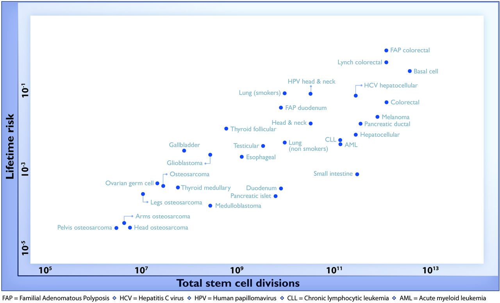

# Miniproject: Germinating in a variable environment

## Mini description
One of the most important decisions in the life of a plant is when to
germinate, as this defines the place where they will be indefinitely anchored
to the ground. Multiple regulatory interactions between plant hormones
form a bistable developmental switch that defines whether the seed will
remain dormant or germinate in response to fluctuating temperature. While
this hormonal circuit is found in each cell of the plant, the organ as a whole
takes the decision to germinate through the coordination of multiple cells
that act as interconnected processors. In this project you will develop a
model of the cells in the radicle to study the decision making process
underlying germination. For this you will model the bistable hormonal
switch, how cells communicate with each other, and how they integrate
fluctuating temperature information in the decision to germinate. 

 {#sc1}

**The model**: 

 

## Guiding questions: 
-	
-	

### Msc:
-	

## References: 
1)

