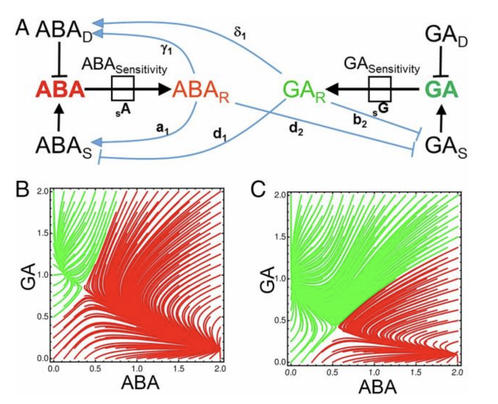
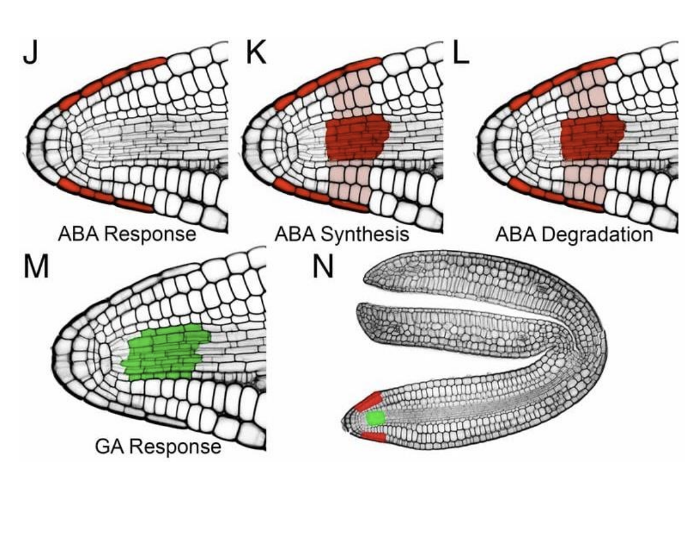

# Miniproject: Germinating in a variable environment

## Mini description
One of the most important decisions in the life of a plant is when to
germinate, as this defines the place where they will be indefinitely anchored
to the ground. This decision is taken considering environmental inputs, that are inherently *variable*. Think of temperature variability during the day, or light flickering due to the canopy and the wind. Multiple regulatory interactions between plant hormones
form a bistable developmental switch that defines whether the seed will
remain dormant or germinate. Temperature inputs are integrated in this regulatory circuit, allowing plants to respond to fluctuating temperature. 

{#p7}

While this hormonal circuit is found in each cell of the plant, the organ as a whole is what
takes the decision to germinate through the coordination of multiple cells
that act as interconnected processors. The cell-to-cell movement of hormones enables such coordination. In this project you will use the model proposed by @topham2017temperature; this models the bistable hormonal switch. Then, you will expand it to a multicellular layout to model the multiple cells of the radicle, and study their contribution in the decision making process underlying germination. Finally, you will use your models (single cell, multicellular) to assess the role of cell-to-cell communication and spatial organization of hormonal responses, in how plants integrate fluctuating temperature information in the decision to germinate. 

## The model 

### Single cell model 

In the supplementary information <https://www.pnas.org/doi/full/10.1073/pnas.1704745114#supplementary-materials> of @topham2017temperature you will find the equations and parameters of the bistable hormonal switch model of plant germination (single cell). This model simulates how two hormones, gibberellic acid (GA) and abscisic acid (ABA) mutually regulate each other in their synthesis, degradation and signaling. 

Implement this equations in python, and explore the effect of different GA and ABA levels. 

- What behaviours do you expect to find from these equations? What do they represent biologically?

Do a phase plane analysis of this model using Grind <https://bioinformatics.bio.uu.nl/rdb/grindR.html>; replicate the plots shown in the paper. 

- How does the dynamics change if you change the sensitivity of each hormone? 

### Multicellular model 

Germination, marked by the rupture of the seed cover (testa), is driven by the rapid elongation of the radicle. Specifically, of the epidermal cells. Notably, ABA and GA responses are enriched in different cells of the radicle and it is unclear how the radicle as a unit makes an integrated decision (Figure 2). To study this we need to expand the bistable hormonal model to a multicellular model in which we account for the spatial separation of hormonal responses.

Expand the model to a multicellular layout to simulate the cells of the radicle. For this, simulate at least four compartments (Figure 3D of @topham2017temperature accountingfor endosperm, root cap, intermediate cell, vasculature), define an ODE model for each, and allow hormonal movement based on what @topham2017temperature reports.

{#p7}

Repeat the analysis you made with the single cell model, and see how the results change. Namely, simulate different levels of ABA and GA, and different sensititivies of each hormone. 

- How does the results change if you model a single cell or multiple cells?

### Constant and  intermittent cold treatments

Low temperature (4ºC) triggers germination, as it increase GA synthesis and ABA degradation. Next, explore the effect of low temperature in both the 1-cell and multicellular models. Low temperature can be included in the model as changes in the parameters controlling GA synthesis and ABA degradation, as both increase in cold conditions. Simulate continuous and intermittent temperature inputs. Compare how each model responds to such cold treatments.

## References: 
1) @topham2017temperature
